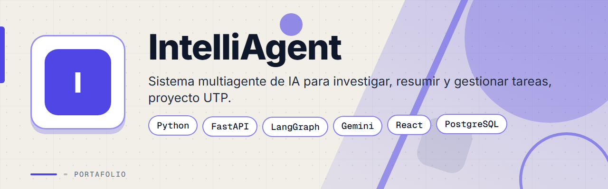
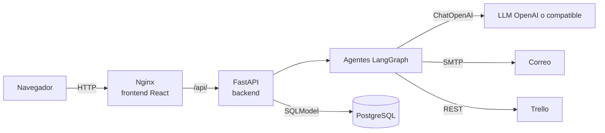

<p align="center">
  
</p>

# IntelliAgent

Sistema multi-agente que investiga un tema, lo resume, extrae datos clave y entrega el resultado por correo y en Trello, todo desde un dashboard web.


[Guía de instalación](docs/INSTALACION.md) | [Despliegue](docs/DESPLIEGUE.md) | [Arquitectura](docs/ARQUITECTURA.md) | [Base de datos](docs/BASE_DE_DATOS.md) | [API](docs/API.md) | [Changelog](CHANGELOG.md)

---

<p align="center">
  
</p>

## Resumen

IntelliAgent recibe un tema desde un dashboard en React y lo procesa en segundo plano con agentes de LangGraph y LangChain detrás de una API FastAPI. El resultado se guarda en PostgreSQL y, si el usuario lo pide, se envía por correo SMTP y se crea una tarjeta en Trello.

- El backend es FastAPI con SQLModel y expone la API en `/api/*` y la documentación interactiva en `/docs`.
- El modelo de lenguaje se crea con `ChatOpenAI` de `langchain-openai`. Se configura por variables `OPENAI_*` y acepta cualquier endpoint compatible con OpenAI.
- El frontend es React 18 compilado con Vite. En contenedor lo sirve Nginx, que reenvía `/api/` al backend.
- Todo se levanta con Docker Compose: base de datos, backend y frontend.
- La API no tiene autenticación (ver [Estado actual](#estado-actual)).

## Funcionalidades

| Funcionalidad | Descripción |
|---------------|-------------|
| Investigación de un tema | `POST /api/research/tasks/` crea la tarea y un agente la procesa en segundo plano |
| Resumen | Una herramienta con el LLM condensa el texto (límite de longitud configurable) |
| Extracción de datos clave | Otra herramienta devuelve JSON con tema principal, puntos clave, datos importantes y conclusiones |
| Entrega por correo | Envía el resultado por SMTP sobre SSL (Gmail por defecto) a la dirección indicada |
| Tarjeta en Trello | Crea una tarjeta en la lista indicada o en la lista por defecto (`TRELLO_DEFAULT_LIST_ID`) |
| Persistencia | Guarda cada tarea y su resultado en PostgreSQL con estados `pending`, `processing`, `completed` y `failed` |
| Dashboard | Formulario de nueva investigación y lista de investigaciones que se refresca cada 5 segundos |
| Chat con el supervisor | `POST /api/chats/` envía un mensaje a un supervisor con un agente de correo y uno de redacción. El dashboard no usa este endpoint |
| Lectura de bandeja | Un agente puede listar correos no leídos por IMAP (Gmail) |
| Documentación interactiva | Swagger de FastAPI en `/docs` |

## Vista previa

<table>
  <tr>
    <td width="50%">
      
      <br><b>Nueva investigación</b>: tema de estudio con envío opcional por correo y tarjeta en Trello.
    </td>
    <td width="50%">
      
      <br><b>Investigaciones recientes</b>: tareas con su estado de procesamiento.
    </td>
  </tr>
  <tr>
    <td width="50%">
      
      <br><b>Resultados</b>: resumen, datos clave y fuentes de cada investigación completada.
    </td>
    <td width="35%" align="center">
      
      <br><b>Versión móvil</b>: la interfaz en pantallas pequeñas.
    </td>
  </tr>
</table>

## Arquitectura



| Componente | Ubicación | Función |
|------------|-----------|---------|
| Entrada de la API | `backend/src/main.py` | Crea la app, CORS, `init_db()` al arrancar y monta los routers `/api/chats` y `/api/research` |
| Rutas de investigación | `backend/src/api/research/` | Modelos `ResearchTask` y `ResearchResult`, endpoints y procesamiento en segundo plano |
| Rutas de chat | `backend/src/api/chat/` | Modelo `ChatMessage` y endpoints de chat |
| Agentes y herramientas | `backend/src/api/ai/` | Agentes de LangGraph, herramientas, esquemas y creación del LLM (`llms.py`) |
| Trello | `backend/src/api/integrations/trello.py` | Cliente REST de Trello |
| Correo | `backend/src/api/myemailer/` | Envío SMTP y lectura IMAP |
| Base de datos | `backend/src/api/db.py` | Motor SQLModel y creación de tablas con `create_all` |
| Dashboard | `frontend/src/App.jsx` | Componente único con formulario y lista de tareas |
| Proxy | `frontend/nginx.conf` | Sirve el frontend compilado y reenvía `/api/` al backend |

La investigación usa un único agente (`complete_research_agent`) con herramientas de búsqueda, resumen, extracción, correo y Trello. Más detalle en [docs/ARQUITECTURA.md](docs/ARQUITECTURA.md).

## Stack tecnológico

| Capa | Tecnología | Versión |
|------|-----------|---------|
| Lenguaje del backend | Python | 3.13.4 (imagen `python:3.13.4-slim-bullseye`) |
| API | FastAPI | 0.115.12 |
| Servidor ASGI | uvicorn | sin versión fijada |
| ORM | SQLModel y driver `psycopg` 3 | sin versión fijada |
| Agentes | LangGraph, `langgraph-supervisor` y LangChain | sin versión fijada |
| LLM | `langchain-openai` (`ChatOpenAI`), modelo por defecto `gpt-4o-mini` | sin versión fijada |
| Base de datos | PostgreSQL | 17.5 |
| Frontend | React y react-dom | ^18.2.0 |
| Empaquetado | Vite y `@vitejs/plugin-react` | ^5.0.0 y ^4.2.0 |
| Cliente HTTP | axios | ^1.6.0 |
| Compilación del frontend | Node.js | 20 (imagen `node:20-alpine`) |
| Servidor web | Nginx | imagen `nginx:alpine` |
| Contenedores | Docker y Docker Compose | sin versión mínima declarada |

## Inicio rápido

Requiere Docker con Docker Compose y una API key de OpenAI (o de un endpoint compatible).

```bash
git clone https://github.com/deadlyrat/IntelliAgent.git
cd IntelliAgent
cp .env.sample .env      # completar con valores propios
docker compose up --build
```

Variables mínimas en `.env`: `API_KEY` (el backend no arranca sin ella, aunque no se usa para validar peticiones), `DATABASE_URL` y `OPENAI_API_KEY`. Para correo se añaden `EMAIL_ADDRESS`, `EMAIL_PASSWORD`, `EMAIL_HOST` y `EMAIL_PORT`. Para Trello se añaden `TRELLO_API_KEY`, `TRELLO_API_TOKEN` y `TRELLO_DEFAULT_LIST_ID`, que el código lee pero `.env.sample` no incluye.

| Servicio | URL |
|----------|-----|
| Dashboard | http://localhost:3000 |
| API | http://localhost:8080 |
| Documentación de la API | http://localhost:8080/docs |
| PostgreSQL (host) | `localhost:5433` |

Para comprobar el servicio, `GET /api/research/` responde `{"status":"ok","module":"research"}`. Los ejemplos de peticiones están en [API_EXAMPLES.md](API_EXAMPLES.md). La guía completa, con variables, verificación y solución de problemas, está en [docs/INSTALACION.md](docs/INSTALACION.md).

Sin Docker, el backend corre con `uvicorn main:app --reload` desde `backend/src` y el frontend con `npm run dev` desde `frontend`. En ese modo hace falta una base PostgreSQL accesible y ajustar el destino del proxy de Vite, que apunta a `http://backend:8000`. El detalle está en la guía de instalación.

## Estructura del proyecto

```
IntelliAgent/
  .env.sample             Variables de entorno de ejemplo
  .env.sample-db          Variables de PostgreSQL de ejemplo (compose no lo usa)
  compose.yaml            Desarrollo: base de datos, backend con recarga y frontend
  compose.prod.yaml       Producción: reinicio automático y 4 workers
  check_setup.py          Script de verificación previa del entorno
  API_EXAMPLES.md         Ejemplos de peticiones con curl, Python y Node
  backend/
    Dockerfile            Imagen de Python 3.13.4
    railway.json          Configuración de despliegue en Railway
    requirements.txt      Dependencias de Python
    src/
      main.py             App FastAPI, CORS y routers
      api/
        db.py             Motor y creación de tablas
        ai/               Agentes, herramientas, esquemas y LLM
        chat/             Modelo y rutas del chat
        research/         Modelos y rutas de investigaciones
        integrations/     Cliente de Trello
        myemailer/        Envío SMTP y lectura IMAP
  frontend/
    Dockerfile            Compilación con Node 20 y servicio con Nginx
    nginx.conf            Proxy de /api/ y caché de estáticos
    vite.config.js        Servidor de desarrollo en el puerto 3000
    src/                  App.jsx, main.jsx e index.css
  static_html/            Sitio estático de plantilla del curso, ajeno a la app
  assets/                 Banner animado y capturas del README
  docs/                   Documentación del proyecto
```

## Estado actual

Esta sección lista lo que el código hace hoy, sin adornos.

- La herramienta `web_search` está simulada: devuelve un texto fijo con fuentes de ejemplo y no consulta la web. El resultado se apoya solo en el conocimiento del modelo.
- Los campos `key_data` y `sources` de cada resultado se guardan con valores fijos (`{"info": "Datos extraidos por el agente"}` y `["Web Search","AI Analysis"]`). Solo el campo `summary` viene del agente.
- No hay pruebas automáticas ni CI.
- La API no tiene autenticación ni autorización. `API_KEY` solo debe existir al arrancar. Cualquier cliente con acceso de red puede crear, listar y borrar tareas y disparar correos y tarjetas de Trello. CORS permite cualquier origen.
- No hay migraciones de base de datos: las tablas se crean con `create_all` al arrancar.
- Los errores de correo y de Trello solo se imprimen en la salida estándar y la tarea queda en `completed` aunque la entrega falle.
- El último commit de la rama principal es del 2026-10-04.

Los detalles de seguridad están en [SECURITY.md](SECURITY.md).

## Documentación

| Documento | Contenido |
|-----------|-----------|
| [docs/INSTALACION.md](docs/INSTALACION.md) | Instalación paso a paso, variables y solución de problemas |
| [docs/DESPLIEGUE.md](docs/DESPLIEGUE.md) | Compose de producción, Railway, proxy inverso, respaldos y actualizaciones |
| [docs/ARQUITECTURA.md](docs/ARQUITECTURA.md) | Componentes, agentes, herramientas y flujo de una investigación |
| [docs/BASE_DE_DATOS.md](docs/BASE_DE_DATOS.md) | Tablas, columnas y relaciones |
| [docs/API.md](docs/API.md) | Endpoints, parámetros y respuestas |
| [API_EXAMPLES.md](API_EXAMPLES.md) | Ejemplos de peticiones |
| [CHANGELOG.md](CHANGELOG.md) | Historial de cambios |
| [SECURITY.md](SECURITY.md) | Política de seguridad y manejo de credenciales |
| [LICENSE](LICENSE) | Licencia MIT |

## Roadmap

- [ ] Reemplazar la búsqueda web simulada por una API de búsqueda real (por ejemplo Tavily o Serper).
- [ ] Extraer los datos clave y las fuentes reales del resultado del agente.
- [ ] Autenticación de usuarios y validación de `API_KEY`.
- [ ] Pruebas automáticas y CI.
- [ ] Exportación de resultados a PDF.

## Contexto académico

Proyecto final del curso de Lenguajes de Programación en la Universidad Tecnológica de Panamá, desarrollado junto con un compañero de curso.

## Licencia

Distribuido bajo licencia MIT. Consulta el archivo [LICENSE](LICENSE).

## Contacto

Pablo Aguirre

- Correo: [pablozam1931@gmail.com](mailto:pablozam1931@gmail.com)
- WhatsApp: [(507) 6517-1870](https://wa.me/50765171870)
- GitHub: [github.com/deadlyrat](https://github.com/deadlyrat)
