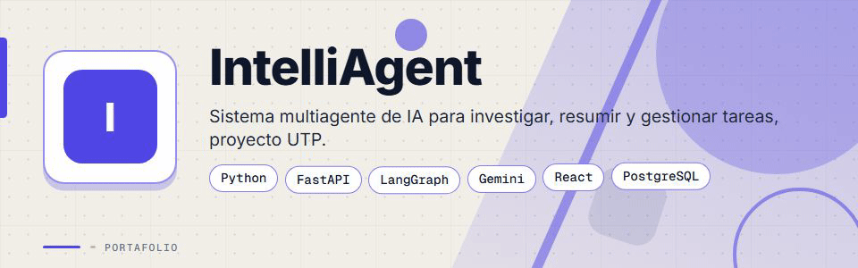
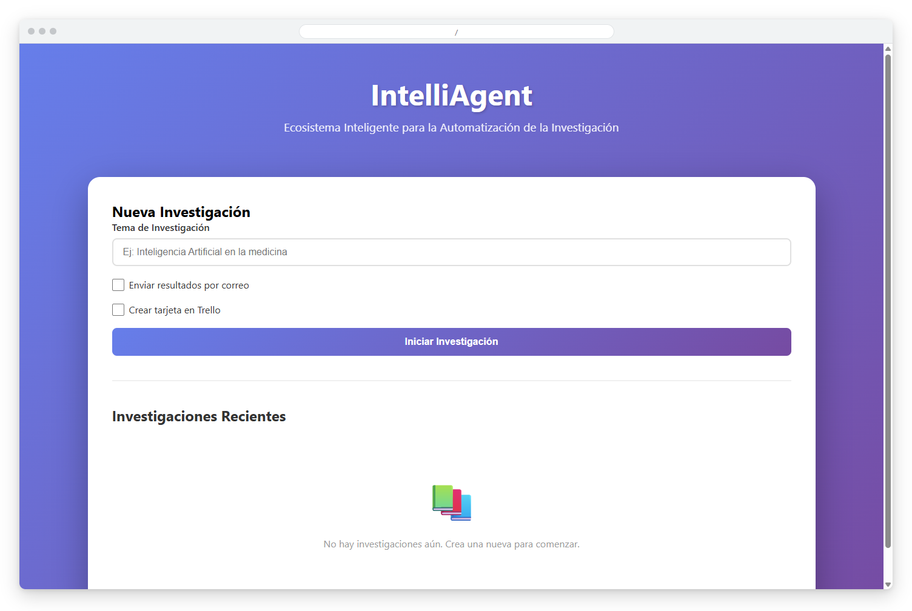
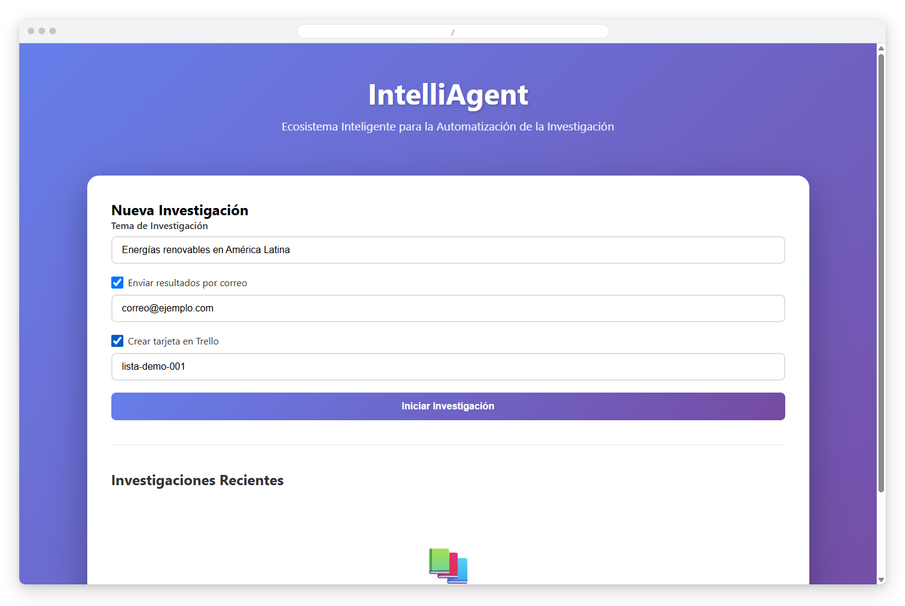
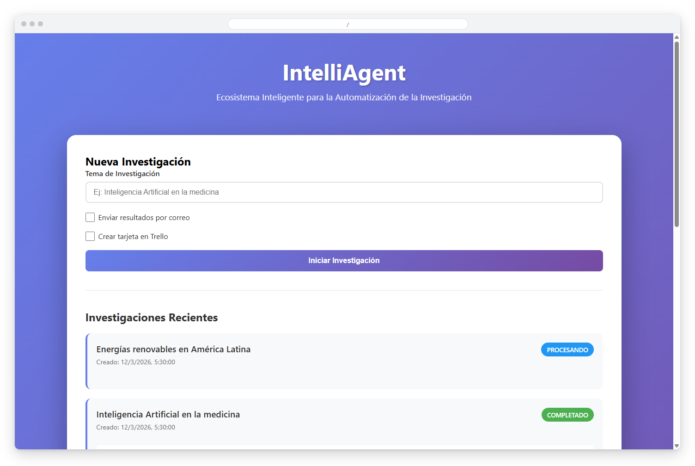
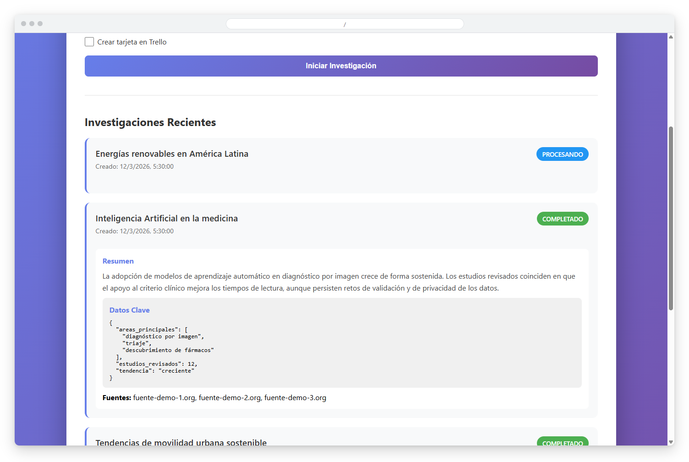
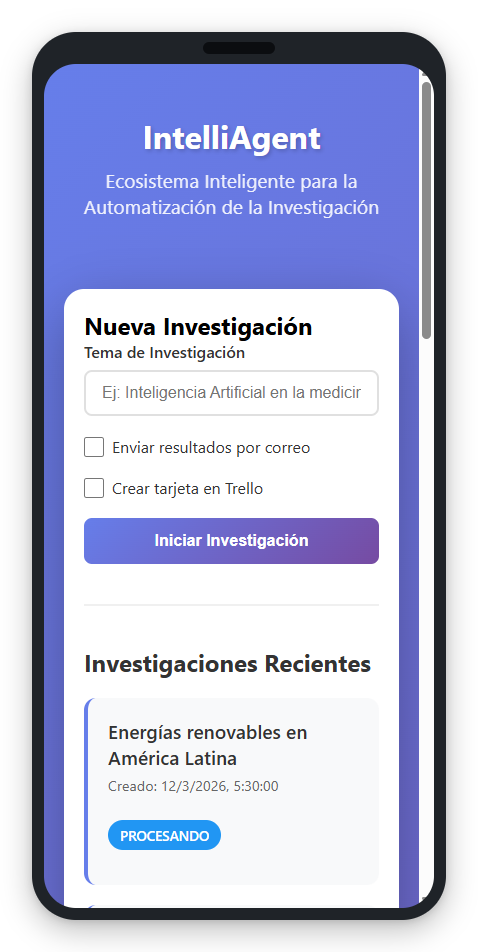
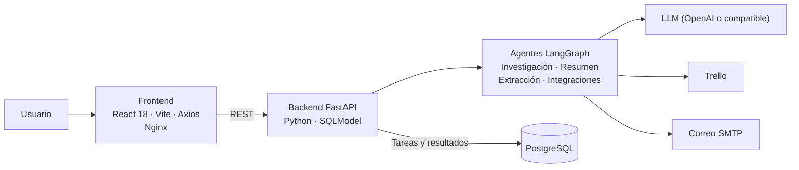

<div align="center">



# IntelliAgent


**Sistema multi-agente de IA que investiga un tema, lo resume, extrae datos clave y entrega los resultados por correo y en Trello, todo desde un dashboard web.**

</div>

---

## Contenido

- [El Problema](#el-problema)
- [La Solución](#la-solución)
- [Funcionalidades](#funcionalidades)
- [Vista Previa](#vista-previa)
- [Arquitectura](#arquitectura)
- [Stack Tecnológico](#stack-tecnológico)
- [Instalación](#instalación)
- [Roadmap](#roadmap)
- [Contexto Académico](#contexto-académico)
- [Licencia](#licencia)
- [Contacto](#contacto)

---

## El Problema

Investigar un tema, resumirlo, extraer lo importante y llevarlo a las herramientas de trabajo del equipo es un proceso manual y repetitivo:

- Reunir información de varias fuentes toma tiempo.
- Condensar el material en un resumen accionable requiere una segunda pasada.
- Los datos clave suelen terminar copiados a mano en tableros de tareas o correos.
- No queda un historial consultable de lo investigado.

---

## La Solución

IntelliAgent orquesta agentes de IA con LangGraph y LangChain detrás de una API FastAPI. El usuario envía un tema desde un dashboard en React; el backend procesa la tarea en segundo plano, guarda el resultado en PostgreSQL y, si se solicita, envía el resumen por correo y crea una tarjeta en Trello.

---

## Funcionalidades

| Funcionalidad | Descripción |
|---------------|-------------|
| Investigación automatizada | Un agente de investigación recibe el tema y coordina a los demás agentes para producir el resultado |
| Resumen | Un agente de resumen condensa el contenido (límite de palabras configurable) |
| Extracción de datos clave | Un agente de extracción estructura los datos principales en formato JSON |
| Integración con Trello | Crea una tarjeta con el resumen en la lista indicada (o en la lista por defecto configurada) |
| Entrega por correo | Envía el resultado a la dirección indicada mediante SMTP sobre SSL (Gmail por defecto) |
| Persistencia | Guarda cada tarea y su resultado en PostgreSQL con SQLModel |
| Estado de las tareas | Cada tarea pasa por estados de procesamiento que el dashboard muestra en la lista de investigaciones |
| Chat con el agente | Endpoint de chat para enviar mensajes al supervisor de agentes y consultar el historial reciente |
| API documentada | Documentación interactiva de FastAPI en `/docs` |

---

## Vista Previa



<table>
  <tr>
    <td width="50%">
      
      <br><b>Nueva investigación</b>: tema de estudio con envío opcional por correo y tarjeta en Trello.
    </td>
    <td width="50%">
      
      <br><b>Investigaciones recientes</b>: tareas con su estado de procesamiento.
    </td>
  </tr>
  <tr>
    <td width="50%">
      
      <br><b>Resultados</b>: resumen, datos clave y fuentes de cada investigación completada.
    </td>
    <td width="50%" align="center">
      
      <br><b>Versión móvil</b>: la interfaz adaptada a pantallas pequeñas.
    </td>
  </tr>
</table>

---

## Arquitectura



**API REST** (prefijo `/api`):

- `POST /api/research/tasks/`, `GET /api/research/tasks/`, `GET /api/research/tasks/{task_id}` y `DELETE /api/research/tasks/{task_id}` para las investigaciones.
- `POST /api/chats/` y `GET /api/chats/recent/` para el chat con el agente.

El modelo se configura por variables de entorno: usa `gpt-4o-mini` por defecto y acepta cualquier endpoint compatible con OpenAI mediante `OPENAI_BASE_URL`.

---

## Stack Tecnológico

| Capa | Tecnología |
|------|-----------|
| Orquestación de agentes | LangGraph · LangChain |
| LLM | OpenAI (modelo configurable, endpoints compatibles con OpenAI) |
| Backend | Python · FastAPI · Uvicorn · SQLModel |
| Base de datos | PostgreSQL 17 |
| Frontend | React 18 · Vite · Axios |
| Infraestructura | Docker · Docker Compose · Nginx |

---

## Instalación

**Requisitos:** Docker Desktop (con Docker Compose), una API key de OpenAI o un endpoint compatible y, de forma opcional, credenciales de Trello y una contraseña de aplicación de Gmail.

1. Clona el repositorio:
   ```bash
   git clone https://github.com/deadlyrat/IntelliAgent.git
   cd IntelliAgent
   ```
2. Crea tu archivo de entorno a partir del ejemplo y completa tus propios valores:
   ```bash
   cp .env.sample .env
   ```
   Variables principales: `API_KEY`, `DATABASE_URL`, `OPENAI_API_KEY`, `OPENAI_MODEL_NAME`, `OPENAI_BASE_URL` (opcional), `EMAIL_ADDRESS`, `EMAIL_PASSWORD`, `EMAIL_HOST`, `EMAIL_PORT`. Para Trello añade `TRELLO_API_KEY`, `TRELLO_API_TOKEN` y `TRELLO_DEFAULT_LIST_ID`.
3. Levanta los servicios:
   ```bash
   docker compose up --build
   ```
4. Abre la aplicación:
   - Dashboard: http://localhost:3000
   - API: http://localhost:8080
   - Documentación de la API: http://localhost:8080/docs

Para desarrollo sin Docker, el backend corre con `uvicorn main:app --reload` desde `backend/src` (tras `pip install -r backend/requirements.txt`) y el frontend con `npm install` y `npm run dev` desde `frontend`.

---

## Roadmap

- [ ] Reemplazar la búsqueda web simulada por una API de búsqueda real (por ejemplo Tavily o Serper).
- [ ] Extraer los datos clave y las fuentes reales del resultado del agente (hoy se guardan valores de ejemplo).
- [ ] Autenticación de usuarios.
- [ ] Exportación de resultados a PDF.

---

## Contexto Académico

Proyecto final del curso de Lenguajes de Programación en la Universidad Tecnológica de Panamá, desarrollado junto con José Herrera. Demuestra orquestación de agentes con LLM, desarrollo full-stack, integración con APIs externas y despliegue en contenedores.

---

## Licencia

Distribuido bajo licencia MIT. Consulta el archivo [LICENSE](LICENSE).

---

## Contacto

Para consultas o propuestas, escríbeme:

[](mailto:pablozam1931@gmail.com)
[%206517--1870-25D366?style=for-the-badge&logo=whatsapp&logoColor=white)](https://wa.me/50765171870)
[](https://github.com/deadlyrat)

- Correo: [pablozam1931@gmail.com](mailto:pablozam1931@gmail.com)
- WhatsApp: [(507) 6517-1870](https://wa.me/50765171870)
- GitHub: [github.com/deadlyrat](https://github.com/deadlyrat)

---

*Parte del portafolio de [deadlyrat](https://github.com/deadlyrat)*
