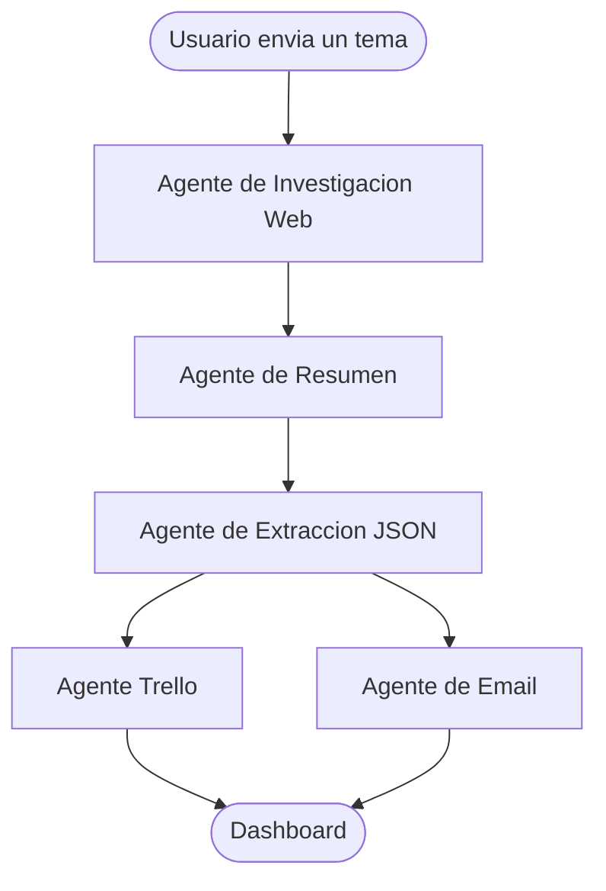
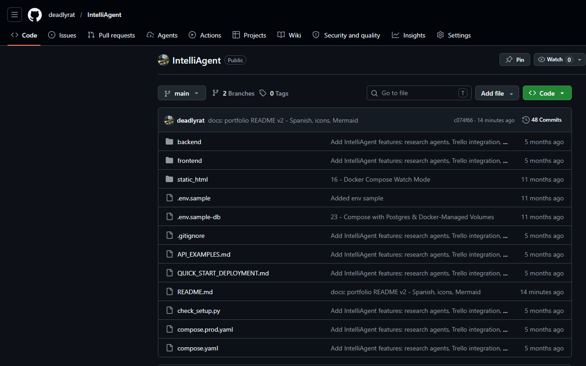

# IntelliAgent

 
 


 
 
 

> **Sistema multi-agente de IA para investigacion automatizada, resumen, extraccion de datos y gestion de tareas.**

IntelliAgent orquesta una cadena de agentes de IA que toman un tema de investigacion, recopilan informacion de la web, la sintetizan, extraen datos estructurados y envian los resultados automaticamente a Trello y por email — todo desde un dashboard web.

---

## Que hace



---

## Funcionalidades

| Funcionalidad | Descripcion |
|--------------|-------------|
| Investigacion web automatizada | Busca en multiples fuentes y agrega resultados sobre cualquier tema |
| Resumen inteligente | Condensa el contenido en resumen accionable |
| Extraccion estructurada | Exporta entidades y datos clave como JSON limpio |
| Integracion con Trello | Crea tarjetas de tareas automaticamente desde los datos extraidos |
| Entrega por email | Envia los resultados resumidos directamente a tu bandeja |
| Persistencia de resultados | Almacena todas las investigaciones en PostgreSQL |
| Dashboard web | Interfaz React para enviar temas, ver estado y explorar resultados |

---

## Arquitectura Tecnica

| Capa | Tecnologia |
|------|-----------|
| Orquestacion de agentes | LangGraph + LangChain |
| LLM | OpenAI GPT-4 |
| API Backend | Python 3.12 · FastAPI · SQLModel |
| Base de datos | PostgreSQL |
| Frontend | React 18 · Vite · Axios |
| Infraestructura | Docker · Docker Compose · Nginx |

---

## Requisitos previos

- [Docker Desktop](https://www.docker.com/products/docker-desktop/) instalado y en ejecucion
- API key de OpenAI
- API key y token de Trello (para la creacion de tareas)
- Credenciales SMTP (para envio de emails)

---

## Inicio Rapido

**1. Clonar el repositorio**
```bash
git clone https://github.com/deadlyrat/IntelliAgent.git
cd IntelliAgent
```

**2. Configurar variables de entorno**
```bash
cp .env.example .env
# Editar .env y completar las claves:
# OPENAI_API_KEY=
# TRELLO_API_KEY=
# TRELLO_TOKEN=
# TRELLO_BOARD_ID=
# SMTP_HOST=
# SMTP_USER=
# SMTP_PASSWORD=
# DATABASE_URL=postgresql://...
```

**3. Iniciar la aplicacion**
```bash
docker-compose up --build
```

La app estara disponible en `http://localhost:3000`.

---

## Vista Previa del Repositorio



---

## Contexto Academico

Este proyecto fue desarrollado como **proyecto final** para el curso de Lenguajes de Programacion en la **Universidad Tecnologica de Panama**. Demuestra orquestacion de LLMs multi-agente, desarrollo full-stack, integracion con APIs externas y despliegue en contenedores.

---

## Licencia

MIT — ver [LICENSE](LICENSE) para mas detalles.
