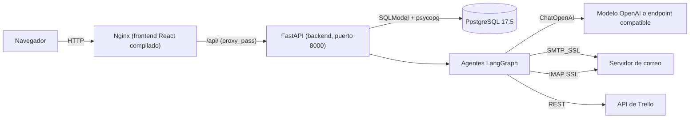
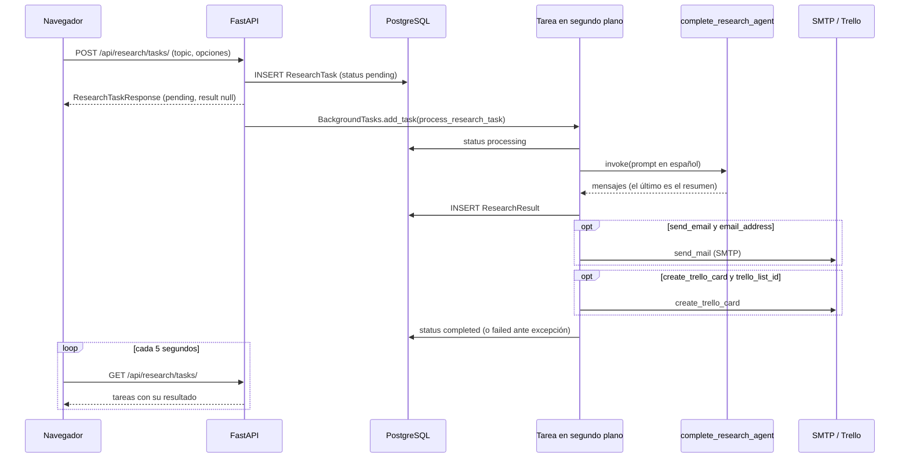

# Arquitectura

Este documento describe cómo está organizado IntelliAgent: los componentes, el flujo de una investigación, los agentes y herramientas, las integraciones y las limitaciones que se conocen. Todo se verificó contra el código commiteado en `backend/` y `frontend/`.

## Vista general

La aplicación se compone de tres servicios que levanta Docker Compose:

1. Un frontend React (Vite) compilado y servido por Nginx.
2. Un backend FastAPI que expone la API JSON bajo `/api/*`.
3. Una base de datos PostgreSQL 17.5.

Nginx sirve los archivos estáticos y reenvía `/api/` al backend. El backend guarda tareas y resultados en PostgreSQL y ejecuta los agentes de LangGraph, que llaman a un modelo compatible con OpenAI. Según lo que pida el usuario, el procesamiento envía un correo por SMTP o crea una tarjeta en Trello.

No hay pruebas automáticas ni CI en el repositorio. No hay migraciones de base de datos: las tablas se crean al arrancar (ver [BASE_DE_DATOS.md](BASE_DE_DATOS.md)).

## Componentes

| Componente | Ubicación | Responsabilidad |
|---|---|---|
| Entrada de la API | `backend/src/main.py` | Crea `FastAPI(title="IntelliAgent API", version="1.0.0")`, configura CORS, llama a `init_db()` en el arranque (lifespan) y monta los routers `/api/chats` y `/api/research`. Exige que exista `API_KEY` al importar |
| Base de datos | `backend/src/api/db.py` | Motor SQLModel, `init_db()` con `create_all` y `get_session()` para inyección de dependencias |
| Rutas de investigación | `backend/src/api/research/` | Modelos `ResearchTask` y `ResearchResult`, endpoints REST y `process_research_task` en segundo plano |
| Rutas de chat | `backend/src/api/chat/` | Modelo `ChatMessage` y endpoints de chat con el supervisor |
| Agentes y herramientas | `backend/src/api/ai/` | Agentes de LangGraph, herramientas, esquemas Pydantic y creación del LLM (`llms.py`) |
| Trello | `backend/src/api/integrations/trello.py` | Cliente REST con `requests` |
| Correo | `backend/src/api/myemailer/` | Envío SMTP (`sender.py`) y lectura IMAP (`inbox_reader.py`, `gmail_imap_parser.py`) |
| Frontend | `frontend/src/App.jsx` | Componente único con formulario y lista de investigaciones |
| Proxy y estáticos | `frontend/nginx.conf` | SPA con `try_files`, `location /api/` hacia `http://backend:8000`, caché de un año para js, css e imágenes |
| Orquestación | `compose.yaml`, `compose.prod.yaml` | Servicios `db_service`, `backend` y `frontend` en la red `intelliagent_network` |

El directorio `static_html/` es un sitio estático de plantilla del curso. No participa en Compose ni en la aplicación.

### Backend

Entrada: `backend/src/main.py`. Detalles que conviene conocer:

- CORS: `allow_origins=["*"]` con `allow_credentials=True`, métodos y cabeceras `*`. El comentario del código indica restringirlo en producción.
- No hay autenticación en ninguna ruta. `API_KEY` solo se comprueba que exista al arrancar y no se usa para validar peticiones.
- Las variables de entorno se leen con `os.environ`. No hay carga de `.env` dentro del código (sin `python-dotenv`); la aportan Compose o el entorno.
- Documentación automática de FastAPI en `/docs`.
- El `Dockerfile` termina en `CMD ["python","-m","http.server","8000"]`. El comando real viene de `command` en Compose o de `startCommand` en `backend/railway.json`: `uvicorn main:app --host 0.0.0.0 --port 8000`.

### Frontend

Entrada: `frontend/src/main.jsx` y `frontend/src/App.jsx` (218 líneas, un solo componente, sin librería de rutas).

- Formulario "Nueva Investigación": tema, casilla de correo con dirección y casilla de Trello con ID de lista.
- Lista "Investigaciones Recientes" con estado y resultado de cada tarea.
- Base de la API: `import.meta.env.VITE_API_URL || '/api'`.
- Hace `GET {API}/research/tasks/` cada 5 segundos y `POST {API}/research/tasks/` al enviar el formulario, con un refresco a 1 segundo. No usa los endpoints de chat ni `DELETE`.

El valor `VITE_API_URL=http://localhost:8080/api` que `compose.yaml` define en el servicio `frontend` es una variable de ejecución de un contenedor Nginx que sirve archivos ya compilados. El `Dockerfile` del frontend usa `ARG VITE_API_URL=/api` en la compilación, así que ese valor no llega al bundle. En la práctica el navegador llama a `/api` y Nginx lo reenvía al backend.

## Flujo de una investigación

Pasos de `process_research_task` (`backend/src/api/research/routing.py`):

1. Marca la tarea como `processing`.
2. Obtiene `get_complete_research_agent()` e invoca al agente con un prompt en español que pide buscar información, generar un resumen y extraer datos clave.
3. Toma el contenido del último mensaje del agente como `summary`.
4. Guarda un `ResearchResult` con `key_data` y `sources` fijos (ver [Limitaciones conocidas](#limitaciones-conocidas)).
5. Si `send_email` es verdadero y hay dirección, llama a `send_mail`. Si `create_trello_card` es verdadero y hay ID de lista, llama a `create_trello_card`. Los errores de ambos pasos solo se imprimen en la salida estándar.
6. Marca la tarea como `completed`. Si cualquier paso anterior lanza una excepción no controlada, la marca como `failed`.

Estados posibles: `pending`, `processing`, `completed`, `failed`.

## Agentes

Se usa LangGraph (`langgraph.prebuilt.create_react_agent` y `langgraph_supervisor.create_supervisor`) sobre LangChain. No se usa CrewAI. Los dos routers crean un `InMemorySaver` como checkpointer, que vive en la memoria del proceso y no persiste.

### Modelo de lenguaje

`get_openai_llm()` en `backend/src/api/ai/llms.py` crea un `langchain_openai.ChatOpenAI`:

| Variable | Obligatoria | Efecto |
|---|---|---|
| `OPENAI_API_KEY` | Sí (falla al importar si falta) | Clave del proveedor |
| `OPENAI_MODEL_NAME` | No | Modelo. Por defecto `gpt-4o-mini` |
| `OPENAI_BASE_URL` | No | Endpoint compatible con OpenAI |

Excepción: `summarize_text` y `extract_key_data` (en `research_tools.py`) crean `ChatOpenAI(temperature=0)` directamente, por lo que dependen de las variables estándar de la librería (`OPENAI_API_KEY`) y no de `OPENAI_MODEL_NAME` ni `OPENAI_BASE_URL`.

### Agentes de chat (`backend/src/api/ai/agents.py`)

| Agente | Herramientas | Uso |
|---|---|---|
| `email_agent` | `send_me_email`, `get_unread_emails` | Gestiona la bandeja de correo |
| `research_agent` | `research_email` | Prepara un correo estructurado |
| Supervisor (`get_supervisor`) | Coordina los dos anteriores | Lo invoca `POST /api/chats/` |

`backend/src/api/ai/assistants.py` (`email_assistant`, bucle manual con `bind_tools`) no se importa desde ninguna ruta.

### Agentes de investigación (`backend/src/api/ai/research_agents.py`)

Prompts en español. Se definen cinco agentes y un supervisor:

| Agente | Herramientas |
|---|---|
| `web_research_agent` | `web_search` |
| `summary_agent` | `summarize_text` |
| `data_extraction_agent` | `extract_key_data` |
| `integration_agent` | `create_task_card`, `send_research_email` |
| `complete_research_agent` | Todas las anteriores (`RESEARCH_TOOLS` e `INTEGRATION_TOOLS`) |
| `get_research_supervisor()` | Supervisor de los cuatro especializados |

La ruta `POST /api/research/tasks/` solo usa `get_complete_research_agent()`. El supervisor de investigación se importa en `routing.py` pero no se invoca.

### Herramientas

Investigación (`backend/src/api/ai/research_tools.py`):

| Herramienta | Qué hace |
|---|---|
| `web_search` | Simulada. Devuelve un texto fijo con fuentes de ejemplo. Un comentario del código sugiere Tavily o Serper. No accede a la web |
| `summarize_text(text, max_length=500)` | El modelo resume el texto |
| `extract_key_data(text)` | El modelo devuelve JSON con `tema_principal`, `puntos_clave`, `datos_importantes` y `conclusiones`. Limpia las marcas de bloque Markdown y valida el JSON |
| `create_task_card(title, description, list_id=None)` | Crea una tarjeta en Trello. Sin `list_id` usa `TRELLO_DEFAULT_LIST_ID` |
| `send_research_email(subject, content, recipient=None)` | Envía un correo por SMTP. Sin destinatario usa `EMAIL_ADDRESS` |
| `research_and_analyze` | Definida y listada en `ALL_RESEARCH_TOOLS`, pero no se asigna a ningún agente |

Chat (`backend/src/api/ai/tools.py`): `research_email`, `send_me_email` (envía al propio `EMAIL_ADDRESS`) y `get_unread_emails(hours_ago=48)` (IMAP, limita la salida a 500 caracteres).

## Integraciones

### Trello

`TrelloClient` en `backend/src/api/integrations/trello.py` usa `requests` contra `https://api.trello.com/1`. Métodos: `create_card` (`POST /cards`), `get_lists` y `get_boards`, más el helper `create_trello_card`. Credenciales por `TRELLO_API_KEY` y `TRELLO_API_TOKEN`, que se envían como parámetros de la URL. Lanza `ValueError` si faltan. Estas variables y `TRELLO_DEFAULT_LIST_ID` se leen en el código pero no aparecen en `.env.sample`.

### Correo (SMTP e IMAP)

| Dirección | Implementación | Configuración |
|---|---|---|
| Salida | `smtplib.SMTP_SSL(EMAIL_HOST, EMAIL_PORT)` con login `EMAIL_ADDRESS` y `EMAIL_PASSWORD` (`sender.py`) | Por defecto `smtp.gmail.com` y puerto 465 |
| Entrada | `GmailImapParser` (`imaplib` contra `imap.gmail.com` con SSL), usado por `read_inbox` | Mismas credenciales |

Está pensado para una contraseña de aplicación de Gmail.

## Limitaciones conocidas

- `web_search` es simulada, así que las investigaciones se basan en el conocimiento del modelo y no en búsquedas reales.
- `key_data` y `sources` de cada resultado son valores fijos del código (`{"info": "Datos extraídos por el agente"}` y `["Web Search", "AI Analysis"]`). El agente no los rellena.
- `research_email` (`backend/src/api/ai/tools.py`) lee `response.content`, pero `EmailMessageSchema` define el campo `contents`. Además espera `metadata["additional_field"]` en la configuración. Puede fallar en tiempo de ejecución, y con ello el flujo de chat que lo usa.
- La `Session` de base de datos obtenida con `Depends(get_session)` se pasa a la tarea en segundo plano (`routing.py`). El generador de sesión puede cerrarse al terminar la respuesta, por lo que el uso posterior es frágil.
- Si falla el correo o Trello, el error solo se imprime y la tarea queda `completed`.
- Las llamadas al modelo son síncronas, tanto en `POST /api/chats/` como en la tarea en segundo plano.
- El checkpointer `InMemorySaver` se pierde al reiniciar el backend. En producción Compose arranca 4 workers de uvicorn, cada uno con su propia memoria.
- `updated_at` de `ResearchTask` no se actualiza al cambiar el estado.
- Sin autenticación, sin límite de peticiones y con CORS abierto. Cualquier cliente con acceso a la red puede crear, listar y borrar tareas y disparar correos y tarjetas de Trello.
- No hay pruebas automáticas ni CI.
- `backend/railway.json` fija el puerto 8000 (no usa `$PORT`) y el `Dockerfile` copia `requirements.txt` y `./src` con rutas relativas, por lo que el contexto de construcción debe ser `backend/`.
