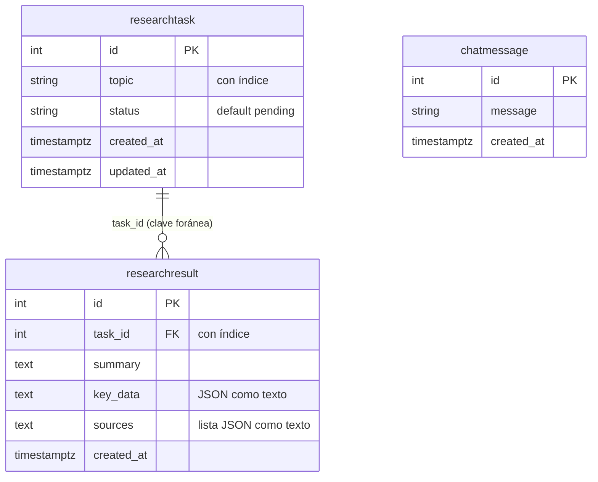

# Base de datos

IntelliAgent guarda sus datos en PostgreSQL 17.5. El acceso se hace con SQLModel (SQLAlchemy) y el controlador psycopg 3. Este documento describe las tres tablas que define el código.

## Alcance y limitaciones

- El repositorio no contiene DDL: no hay archivos `.sql`, migraciones (no se usa Alembic) ni datos de ejemplo.
- Las tablas se crean al arrancar el backend: `init_db()` en `backend/src/api/db.py` ejecuta `SQLModel.metadata.create_all(engine)`. El propio código lo comenta: "does not create db migrations". `create_all` solo crea las tablas que faltan. Si un modelo cambia después, las tablas existentes no se alteran.
- Los modelos que registra `create_all` son los que importan los routers de `chat` y `research`.
- La relación entre tablas se declara con una clave foránea (`task_id`). No hay `Relationship` del ORM: el código consulta los resultados por `task_id`.
- Las credenciales de la base y su URL no forman parte de este documento. La aplicación lee `DATABASE_URL` del entorno. Use el prefijo `postgresql+psycopg://`. El código reescribe `postgres://` a `postgres+psycopg://`, pero SQLAlchemy 2 no tiene un dialecto llamado `postgres`, así que esa forma falla al importar el backend.

## Conexión

| Aspecto | Valor |
|---|---|
| Motor | PostgreSQL 17.5 (`postgres:17.5` en Compose) |
| Controlador | `psycopg[binary]` (psycopg 3) |
| Variable | `DATABASE_URL` |
| Contenedor de desarrollo | `intelliagent_db`, puerto 5433 del host hacia 5432 |
| Volumen | `dc_managed_db_volume`, montado en `/var/lib/postgresql/data` |

Si `DATABASE_URL` no está definida, el backend falla al importar `db.py` con un error de tipo, porque la comprobación `== ""` no cubre el valor `None`.

## Diagrama entidad relación

`chatmessage` no tiene relación con las otras dos tablas.

## Tablas

SQLModel usa como nombre de tabla la clase en minúsculas.

### chatmessage

Definida en `backend/src/api/chat/models.py`. Guarda cada mensaje que llega a `POST /api/chats/`.

| Columna | Tipo | Restricciones | Descripción |
|---|---|---|---|
| `id` | entero | Clave primaria, autoincremental | Identificador |
| `message` | texto | Obligatoria | Texto enviado por el usuario |
| `created_at` | `timestamptz` | No nula. Valor por defecto: fecha y hora UTC actual | Momento de creación |

### researchtask

Definida en `backend/src/api/research/models.py`. Una fila por investigación solicitada.

| Columna | Tipo | Restricciones | Descripción |
|---|---|---|---|
| `id` | entero | Clave primaria, autoincremental | Identificador |
| `topic` | texto | Con índice | Tema de la investigación |
| `status` | texto | Por defecto `pending` | `pending`, `processing`, `completed` o `failed` |
| `created_at` | `timestamptz` | No nula. Por defecto UTC actual | Momento de creación |
| `updated_at` | `timestamptz` | No nula. Por defecto UTC actual | Ver la nota siguiente |

`updated_at` nunca se actualiza. `process_research_task` cambia `status` y confirma la transacción, pero no modifica `updated_at`, así que conserva el valor de la creación.

### researchresult

Definida en `backend/src/api/research/models.py`. Guarda el resultado de una tarea.

| Columna | Tipo | Restricciones | Descripción |
|---|---|---|---|
| `id` | entero | Clave primaria, autoincremental | Identificador |
| `task_id` | entero | Clave foránea a `researchtask.id`, con índice | Tarea a la que pertenece |
| `summary` | `TEXT` | Obligatoria | Contenido del último mensaje del agente |
| `key_data` | `TEXT` | Obligatoria | Objeto JSON serializado como cadena |
| `sources` | `TEXT` | Obligatoria | Lista JSON serializada como cadena |
| `created_at` | `timestamptz` | No nula. Por defecto UTC actual | Momento de creación |

El modelo `ResearchResult` convierte `key_data` y `sources` de nuevo a objeto y lista (`get_key_data_dict`, `get_sources_list`). Si el JSON no es válido, devuelve `{}` y `[]`. Hoy el código siempre guarda valores fijos en estas dos columnas (ver [ARQUITECTURA.md](ARQUITECTURA.md#limitaciones-conocidas)).

## Relaciones

| Relación | Tipo | Cómo se resuelve |
|---|---|---|
| `researchtask` a `researchresult` | Uno a muchos por diseño (en la práctica uno a uno) | Clave foránea `task_id`. El código consulta con `where(ResearchResult.task_id == ...)` y toma el primer resultado |
| `chatmessage` con las demás | Ninguna | No hay vínculo entre los mensajes de chat y las tareas |

La clave foránea `task_id` está declarada en el modelo. La cardinalidad uno a uno es inferida: ninguna restricción única impide varios resultados para una tarea, pero el flujo de `process_research_task` inserta uno solo.

Al borrar con `DELETE /api/research/tasks/{task_id}`, el endpoint elimina primero los resultados asociados y luego la tarea. El borrado en cascada es manual, no una regla `ON DELETE` de la base.

## Consultas habituales

- Listado de tareas: `researchtask` ordenada por `created_at` descendente, tomando las 20 primeras, y una consulta de `researchresult` por cada tarea.
- Mensajes recientes: `select(ChatMessage)` sin orden explícito, tomando los 10 primeros que devuelve la base.

## Respaldos y datos

Los datos persisten en el volumen `dc_managed_db_volume`. Los respaldos con `pg_dump` y su restauración están en [DESPLIEGUE.md](DESPLIEGUE.md).
