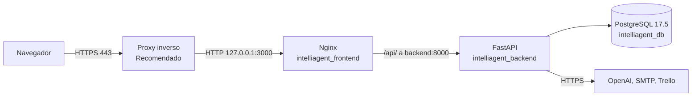

# Guía de despliegue

Esta guía explica cómo publicar IntelliAgent. Cubre el archivo `compose.prod.yaml` del repositorio, la configuración de Railway que existe en `backend/railway.json` y un procedimiento genérico para un VPS con Docker Compose. Incluye proxy inverso con HTTPS, firewall, respaldos, actualizaciones y reversión.

## Qué está automatizado y qué no

El repositorio tiene `compose.yaml` (desarrollo), `compose.prod.yaml` (producción) y `backend/railway.json`. No tiene CI, pruebas automáticas, scripts de despliegue, configuración de HTTPS ni migraciones de base de datos. Cada sección marca los pasos así:

| Marca | Significado |
|---|---|
| Existente | Ya está en el repositorio (`compose.prod.yaml`, `backend/railway.json`, `frontend/nginx.conf`) |
| Recomendado | Práctica sugerida que el repositorio no trae y que no se ha probado en este proyecto |

Las variables de entorno están descritas en [INSTALACION.md](INSTALACION.md#7-variables-de-entorno). Las plantillas son `.env.example` (completa) y `.env.sample` (original, sin las variables de Trello).

## Arquitectura de producción

Tres contenedores en una red bridge (`intelliagent_network`). El frontend es Nginx: sirve la aplicación compilada y reenvía `/api/` al backend. La base de datos guarda los datos en un volumen nombrado.



## 1. Compose de producción

Existente. `compose.prod.yaml` difiere de `compose.yaml` en lo siguiente:

| Aspecto | `compose.yaml` (desarrollo) | `compose.prod.yaml` |
|---|---|---|
| Reinicio | No definido | `restart: unless-stopped` en los tres servicios |
| Backend | `command: uvicorn main:app --host 0.0.0.0 --port 8000 --reload` y bind mount de `./backend/src` | `command: uvicorn main:app --host 0.0.0.0 --port 8000 --workers 4`, sin bind mount |
| Frontend, puertos | `3000:80` | `80:80` y `3000:80` |
| Frontend, compilación | Argumento por defecto `/api` | `build.args` con `VITE_API_URL=/api` |
| Base de datos, puerto | `5433:5432` | `5433:5432` (también se publica) |

El `CMD` del `backend/Dockerfile` es `python -m http.server 8000`, así que la imagen sola no sirve la API. En ambos archivos Compose el `command` del backend reemplaza ese `CMD`; por eso no hay que tocar el Dockerfile para usar Compose.

Instalar Docker y obtener el código en el servidor (ver la sección 3 para preparar el servidor), luego:

```bash
git clone https://github.com/deadlyrat/IntelliAgent.git
cd IntelliAgent
cp .env.example .env
```

Edite `.env` con valores reales (ver la tabla de variables). Con Compose, `DATABASE_URL` usa el host `db_service` y el puerto 5432.

Levantar:

```bash
docker compose -f compose.prod.yaml up -d --build
docker compose -f compose.prod.yaml ps
```

Resultado esperado: tres contenedores arriba, `intelliagent_db` en `healthy`.

Comprobar desde el propio servidor:

```bash
curl http://localhost:8080/
curl http://localhost:3000/api/research/
```

Puntos que conviene conocer antes de exponerlo:

- Las credenciales de la base de datos (`POSTGRES_USER`, `POSTGRES_PASSWORD`, `POSTGRES_DB`) están escritas en texto plano dentro de `compose.prod.yaml`, con valores de ejemplo. Cambiarlas exige editar el archivo y, si el volumen ya existe, también cambiar la clave dentro de PostgreSQL (el volumen conserva la anterior). Ver [SECURITY.md](../SECURITY.md).
- Los puertos 5433 (base de datos) y 8080 (API) se publican en todas las interfaces del host. La API no tiene autenticación: quien llegue al puerto puede crear, listar y borrar tareas y disparar correos y tarjetas de Trello.
- CORS acepta cualquier origen.
- Las tablas se crean al arrancar con `create_all`. No hay migraciones.

## 2. Railway

Existente: `backend/railway.json`. El `startCommand` de Railway reemplaza el `CMD` del `backend/Dockerfile` (`python -m http.server 8000`), que no arranca la API. Declara el constructor `DOCKERFILE`, `dockerfilePath: backend/Dockerfile`, los `watchPatterns` y `startCommand: uvicorn main:app --host 0.0.0.0 --port 8000`. Este procedimiento no se ha verificado en este proyecto y el archivo tiene un desajuste que debe resolverse antes de usarlo.

Problemas conocidos del archivo:

- Desajuste de contexto. `backend/Dockerfile` usa rutas relativas a la carpeta `backend/` (`COPY requirements.txt` y `COPY ./src`), pero `dockerfilePath` es `backend/Dockerfile`, que presupone un contexto en la raíz del repositorio. Con el contexto en la raíz esas rutas no existen y la compilación falla. Alternativas: fijar el directorio raíz del servicio en `backend` en Railway y dejar `dockerfilePath` como `Dockerfile`, o ajustar los `COPY` del Dockerfile. Los `watchPatterns` (`src/**`, `requirements.txt`) también son relativos a `backend/`.
- Puerto fijo. El comando de arranque usa el 8000 y no `$PORT`. Hay que indicar a Railway que el puerto objetivo del servicio es 8000.
- Solo cubre el backend. El frontend y la base de datos no están en `railway.json`. La base se crea como servicio PostgreSQL aparte y su URL va en `DATABASE_URL` (con prefijo `postgresql+psycopg://`; ver [INSTALACION.md](INSTALACION.md#3-configurar-las-variables-de-entorno)). El frontend necesitaría otro servicio con `frontend/Dockerfile` y `VITE_API_URL` apuntando a la URL pública del backend, porque en esa topología no existe el proxy de Nginx con el host `backend`.
- Las variables de entorno se cargan en el panel de Railway, no desde `.env`.

## 3. VPS con Docker Compose (genérico)

Recomendado. Procedimiento para un servidor Linux (Ubuntu o Debian) con una IP pública y un dominio. Se construye sobre `compose.prod.yaml`. Los marcadores entre `<` y `>` se reemplazan por sus valores.

| Marcador | Significado |
|---|---|
| `<IP_DEL_SERVIDOR>` | IP pública del VPS |
| `<USUARIO_DEPLOY>` | Usuario sin privilegios de administrador que ejecuta Docker |
| `<DOMINIO>` | Nombre de dominio que apunta al servidor |

### 3.1 Usuario de despliegue

La primera conexión suele ser con el usuario administrador que entrega el proveedor. Cree un usuario normal y deje de usar el administrador:

```bash
ssh <USUARIO_ADMIN>@<IP_DEL_SERVIDOR>
sudo adduser <USUARIO_DEPLOY>
sudo usermod -aG sudo <USUARIO_DEPLOY>
```

Copie su clave pública SSH al nuevo usuario desde su máquina:

```bash
ssh-copy-id <USUARIO_DEPLOY>@<IP_DEL_SERVIDOR>
ssh <USUARIO_DEPLOY>@<IP_DEL_SERVIDOR>
```

Cuando el acceso por clave funcione, en `/etc/ssh/sshd_config` establezca `PermitRootLogin no` y `PasswordAuthentication no`, y recargue:

```bash
sudo systemctl reload ssh
```

No cierre su sesión actual hasta confirmar en otra terminal que puede entrar con el usuario nuevo.

### 3.2 Docker

Instale Docker Engine y el plugin de Compose siguiendo la guía oficial de su distribución: https://docs.docker.com/engine/install/. Después permita que el usuario de despliegue use Docker:

```bash
sudo usermod -aG docker <USUARIO_DEPLOY>
```

Cierre sesión y vuelva a entrar. Tenga presente que pertenecer al grupo `docker` equivale a tener permisos de administrador en el servidor, así que use claves SSH y limite quién tiene acceso a esa cuenta.

```bash
docker --version
docker compose version
```

### 3.3 Firewall

Con `ufw`, permita solo SSH, HTTP y HTTPS:

```bash
sudo ufw allow OpenSSH
sudo ufw allow 80/tcp
sudo ufw allow 443/tcp
sudo ufw enable
sudo ufw status
```

Advertencia: los puertos que Docker publica con `ports:` se insertan en iptables antes que las reglas de `ufw`, por lo que `ufw` no los bloquea. Con `compose.prod.yaml` tal como está, los puertos 5433 y 8080 quedarían abiertos aunque `ufw` no los permita. Para evitarlo, limite la publicación a la dirección local (sección 3.5).

### 3.4 Código y variables

```bash
sudo mkdir -p /opt/intelliagent
sudo chown <USUARIO_DEPLOY>:<USUARIO_DEPLOY> /opt/intelliagent
git clone https://github.com/deadlyrat/IntelliAgent.git /opt/intelliagent
cd /opt/intelliagent
cp .env.example .env
chmod 600 .env
```

Edite `.env` con valores reales. Antes de levantar nada, cambie también la clave de la base de datos en `compose.prod.yaml` (y la misma clave en `DATABASE_URL`). Haga ese cambio en un archivo propio en lugar de editar el versionado, para que `git pull` no genere conflictos (sección 3.5).

### 3.5 Archivo de producción propio

Compose combina varios archivos con `-f`. Una lista `ports` de un archivo posterior se suma a la anterior en vez de reemplazarla, salvo que use la etiqueta `!override`, disponible desde Compose 2.24. Cree `compose.vps.yaml` junto a `compose.prod.yaml` (no lo versione si contiene datos propios del servidor):

```yaml
services:
  db_service:
    ports: !override
      - "127.0.0.1:5433:5432"
  backend:
    ports: !override
      - "127.0.0.1:8080:8000"
  frontend:
    ports: !override
      - "127.0.0.1:3000:80"
```

Con esto, los tres servicios solo aceptan conexiones desde el propio servidor y el puerto 80 queda libre para el proxy inverso. Si su versión de Compose es anterior a 2.24, copie `compose.prod.yaml` a un archivo propio y edite la sección `ports` directamente.

Levantar con ambos archivos:

```bash
docker compose -f compose.prod.yaml -f compose.vps.yaml up -d --build
docker compose -f compose.prod.yaml -f compose.vps.yaml ps
```

Comprobar:

```bash
curl http://127.0.0.1:3000/api/research/
```

Resultado esperado: una respuesta JSON del módulo de investigación.

### 3.6 Proxy inverso y HTTPS

El repositorio no configura HTTPS. En el host, Nginx con Certbot es una opción habitual. Antes, cree un registro DNS de tipo A de `<DOMINIO>` hacia `<IP_DEL_SERVIDOR>`.

```bash
sudo apt install nginx certbot python3-certbot-nginx
```

Cree `/etc/nginx/sites-available/intelliagent`:

```nginx
server {
    listen 80;
    server_name <DOMINIO>;

    location / {
        proxy_pass http://127.0.0.1:3000;
        proxy_http_version 1.1;
        proxy_set_header Host $host;
        proxy_set_header X-Real-IP $remote_addr;
        proxy_set_header X-Forwarded-For $proxy_add_x_forwarded_for;
        proxy_set_header X-Forwarded-Proto $scheme;
    }
}
```

Active el sitio y pida el certificado:

```bash
sudo ln -s /etc/nginx/sites-available/intelliagent /etc/nginx/sites-enabled/intelliagent
sudo nginx -t
sudo systemctl reload nginx
sudo certbot --nginx -d <DOMINIO>
```

Resultado esperado: `https://<DOMINIO>` carga el dashboard con candado válido y `https://<DOMINIO>/api/research/` responde. Certbot programa la renovación automática; compruébela con `sudo certbot renew --dry-run`.

Como la API no tiene autenticación y el dashboard tampoco, publicar el dominio abierto expone todas las funciones a internet. Recomendado antes de publicarlo: añadir autenticación básica en el proxy (`auth_basic` de Nginx) o restringir el acceso por IP o por VPN.

### 3.7 Volúmenes

`compose.prod.yaml` declara un único volumen nombrado, `dc_managed_db_volume`, montado en `/var/lib/postgresql/data`. Compose antepone el nombre del proyecto (por defecto, el de la carpeta), por ejemplo `intelliagent_dc_managed_db_volume`. Para ver el nombre real y su ubicación:

```bash
docker volume ls
docker volume inspect <NOMBRE_DEL_VOLUMEN>
```

`docker compose down` conserva el volumen. `docker compose down -v` lo borra junto con todas las tareas y resultados guardados. No use `-v` en producción sin un respaldo.

## 4. Respaldos

Recomendado. La base guarda las tareas de investigación y sus resultados. Un volcado lógico con `pg_dump` desde el contenedor es la forma más simple. Reemplace `<USUARIO>` y `<BASE>` por los valores fijados en el Compose:

```bash
mkdir -p ~/respaldos
docker compose -f compose.prod.yaml exec -T db_service pg_dump -U <USUARIO> <BASE> | gzip > ~/respaldos/intelliagent-$(date +%F).sql.gz
```

Resultado esperado: un archivo `.sql.gz` con tamaño mayor que cero.

Programar un respaldo diario con `cron` del usuario de despliegue (`crontab -e`):

```text
0 3 * * * cd /opt/intelliagent && docker compose -f compose.prod.yaml exec -T db_service pg_dump -U <USUARIO> <BASE> | gzip > /home/<USUARIO_DEPLOY>/respaldos/intelliagent-$(date +\%F).sql.gz
```

Copie los respaldos fuera del servidor (otro equipo o almacenamiento de objetos) y borre los antiguos con una política que usted defina. Pruebe una restauración antes de necesitarla.

Restaurar en una base vacía:

```bash
gunzip -c ~/respaldos/intelliagent-<FECHA>.sql.gz | docker compose -f compose.prod.yaml exec -T db_service psql -U <USUARIO> -d <BASE>
```

También debe respaldar `.env` (con las claves) en un lugar seguro y privado, fuera del repositorio.

## 5. Actualizaciones

Recomendado. Con la configuración de la sección 3:

```bash
cd /opt/intelliagent
git pull
docker compose -f compose.prod.yaml -f compose.vps.yaml up -d --build
docker image prune -f
```

Antes de actualizar, haga un respaldo (sección 4). `up -d --build` recompila las imágenes cuyo contexto cambió y recrea solo los contenedores afectados. Hay unos segundos de corte mientras se recrea el backend o el frontend.

Como no hay migraciones, una actualización que cambie las columnas de un modelo no altera las tablas existentes: `create_all` solo crea tablas que faltan. Revise los modelos en `backend/src/api/chat/models.py` y `backend/src/api/research/models.py` antes de actualizar, y altere la tabla con SQL si hace falta.

Para actualizar las dependencias sin versión fijada de `backend/requirements.txt` (solo `fastapi` está fijada), reconstruya sin caché: `docker compose -f compose.prod.yaml -f compose.vps.yaml build --no-cache backend`. Una reconstrucción puede traer versiones nuevas de LangChain o LangGraph que cambien el comportamiento, y no hay pruebas que lo detecten.

### Reversión

Recomendado. Anote el commit actual (`git rev-parse --short HEAD`) antes de actualizar. Para volver:

```bash
git checkout <COMMIT_ANTERIOR>
docker compose -f compose.prod.yaml -f compose.vps.yaml up -d --build
```

Si la actualización alteró datos, restaure también el respaldo de la sección 4.

## 6. Verificaciones y registros

Recomendado.

```bash
docker compose -f compose.prod.yaml ps
docker compose -f compose.prod.yaml logs -f backend
docker compose -f compose.prod.yaml logs --since 1h
```

Lista de comprobación tras un despliegue:

- [ ] `ps` muestra los tres contenedores arriba y la base en `healthy`.
- [ ] `curl http://127.0.0.1:3000/` devuelve el HTML del dashboard.
- [ ] `curl http://127.0.0.1:3000/api/research/` devuelve JSON.
- [ ] `https://<DOMINIO>` carga con certificado válido.
- [ ] Una investigación de prueba llega a `completed`.
- [ ] Los puertos 5433 y 8080 no responden desde fuera del servidor (compruébelo desde otra máquina).
- [ ] Existe un respaldo reciente y se probó restaurarlo.

Con `restart: unless-stopped`, los contenedores vuelven a levantarse tras reiniciar el servidor siempre que el servicio de Docker arranque con el sistema (`sudo systemctl enable docker`).

## 7. Problemas frecuentes

| Síntoma | Causa | Qué hacer |
|---|---|---|
| `port is already allocated` en el puerto 80 | Nginx del host u otro servicio usa el 80 | Use `compose.vps.yaml` (sección 3.5) para que el contenedor no publique el 80 |
| La compilación en Railway no encuentra `requirements.txt` | Desajuste de contexto de `railway.json` (sección 2) | Fije el directorio raíz en `backend` o ajuste los `COPY` |
| Railway no recibe tráfico | El servicio escucha en el 8000 y Railway espera otro puerto | Indique 8000 como puerto objetivo |
| `502 Bad Gateway` tras actualizar | El backend tarda en arrancar o falló | `docker compose -f compose.prod.yaml logs backend` |
| El backend se reinicia en bucle | Falta `API_KEY`, `OPENAI_API_KEY` o `DATABASE_URL` | Revise `.env` y recree: `docker compose -f compose.prod.yaml up -d backend` |
| Cambié la clave de la base en el Compose y falla la conexión | El volumen conserva la clave anterior | Cambie la clave dentro de PostgreSQL con `ALTER USER` o restaure en un volumen nuevo |
| `check_setup.py` pide `.env.example` | Referencia antigua al nombre de la plantilla | `.env.example` ya existe: `cp .env.example .env` |
| Los puertos 5433 u 8080 son alcanzables desde internet pese a `ufw` | Docker publica los puertos antes que `ufw` | Sección 3.5: publicar solo en `127.0.0.1` |
